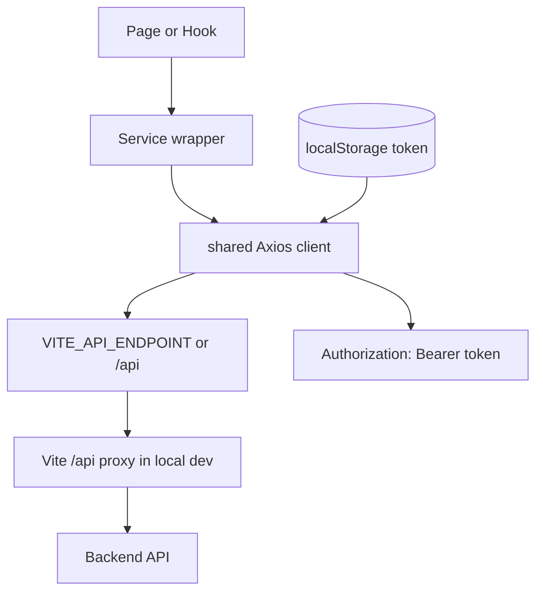
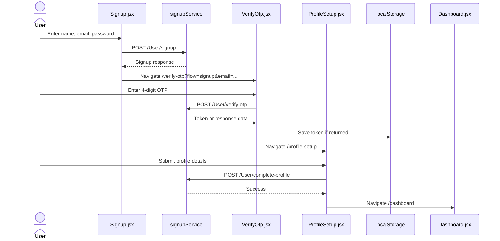
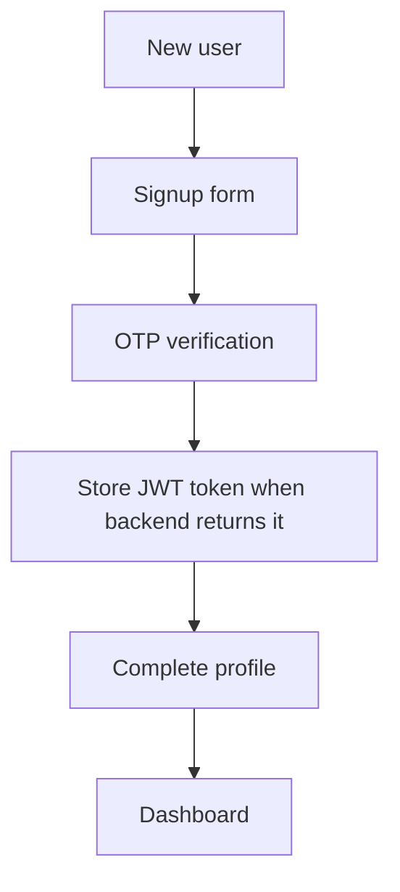

# SheCare UI

SheCare UI is a React + Vite frontend for a women's wellness and cycle-care application. It provides authentication, OTP verification, profile onboarding, a daily wellness dashboard, cycle insights, symptom logging, yoga routines, and diet-plan screens.

This README is based on the current codebase in `she-care-ui/`. It documents what is implemented today, including which screens call backend APIs and which screens currently use local/mock data.

## Project Overview

### Purpose

SheCare UI helps users track and understand wellness signals such as cycle dates, symptoms, mood, hydration, sleep, activity, diet, yoga routines, and profile health information. The frontend is designed as a mobile-first wellness app shell with a calm visual language, personalized dashboard cards, and backend-backed authentication and cycle APIs.

### Key Features And Modules

| Area | Current implementation |
| --- | --- |
| Authentication | Signup, login, OTP verification, JWT storage in `localStorage`, logout from profile sidebar |
| Onboarding | Profile setup form with age, height, weight, city, health goal, sex, and blood group |
| Dashboard | Fetches latest daily entry/summary, normalizes backend responses, shows fallback data if API fails |
| Daily Entry | Full daily log form for mood, sleep, stress, activity, diet, symptoms, cycle, hydration, notes |
| Cycle Insights | Saves cycle dates, fetches prediction/insight endpoints, supports conception mode guidance |
| Symptoms | Rich symptom and reproductive-health logging UI; saves draft locally and updates conception mode via API |
| Yoga | Static/interactive yoga routine experience with timers and cycle-phase content |
| Diet Plan | Mock-data-driven diet dashboard with Framer Motion animations |
| Profile Sidebar | Theme switcher, settings sections, focus trap, logout behavior |
| Theming | Light/dark/system theme stored in `localStorage` and applied through CSS variables |

### Technology Stack

| Technology | Purpose |
| --- | --- |
| React `19.2.0` | UI component framework |
| Vite `7.2.4` | Dev server, build tooling, local API proxy |
| React Router DOM `7.11.0` | Client-side routing |
| Axios `1.13.6` | HTTP client and JWT request interceptor |
| Framer Motion `12.38.0` | Animations in diet page and profile sidebar |
| Lucide React `0.552.0` | Sidebar/profile icons |
| Tailwind CSS `3.4.5` + PostCSS | Utility classes available globally |
| CSS Modules | Page-level scoped styling |
| ESLint `9.39.1` | Static analysis for JS/JSX |

## Project Architecture

### Repository Layout

The workspace currently has an outer folder and an inner Vite app:

```text
SheCareUI/
|-- package.json              # Outer package; currently also configured to serve inner app
|-- vite.config.js            # Outer Vite config with root: 'she-care-ui'
`-- she-care-ui/              # Actual UI app package developers should work in
    |-- .env                  # Vite env variables for API base/proxy target
    |-- index.html            # App HTML shell
    |-- package.json          # Main frontend dependencies and scripts
    |-- postcss.config.js     # Tailwind + autoprefixer config
    |-- tailwind.config.js    # Tailwind content/theme config
    |-- vite.config.js        # Inner app Vite config and /api proxy
    `-- src/
        |-- api/
        |   `-- axois.jsx     # Compatibility re-export of services/api.js; filename has typo
        |-- assets/           # PNG/SVG images used by auth/onboarding pages
        |-- components/       # Shared UI components
        |-- fonts/            # MoreSugar font files
        |-- hooks/            # Reusable React hooks
        |-- pages/            # Route-level screens
        |-- services/         # Axios client and API wrappers
        |-- styles/           # Global theme tokens
        |-- App.jsx           # Router, theme state, app shell
        |-- index.css         # Tailwind directives and global shell styles
        `-- main.jsx          # React entry point
```

### Source Folder Explanation

| Path | Responsibility |
| --- | --- |
| `src/main.jsx` | Mounts React into `#root`, imports global theme and index styles |
| `src/App.jsx` | Defines routes, redirects `/` to `/signup`, owns theme state |
| `src/pages/` | One component per route/screen, mostly paired with CSS Modules |
| `src/services/api.js` | Shared Axios instance, base URL, JWT request interceptor |
| `src/services/signupService.js` | Signup, OTP verification, login, profile completion APIs |
| `src/services/dashboardService.js` | Dashboard and daily entry APIs |
| `src/services/cycleService.js` | Cycle prediction, cycle save, conception mode APIs |
| `src/hooks/useCycleData.js` | Loads multiple cycle insight endpoints with `Promise.allSettled` |
| `src/components/ProfileSidebar.jsx` | Settings drawer, theme selector, logout, focus handling |
| `src/styles/theme.css` | CSS variables for light/dark themes and semantic utility classes |

### Component Hierarchy

```mermaid
graph TD
  main[src/main.jsx] --> App[src/App.jsx]
  App --> Router[BrowserRouter]
  Router --> Signup[/signup Signup]
  Router --> Login[/login Login]
  Router --> VerifyOtp[/verify-otp VerifyOtp]
  Router --> CreatePassword[/createPassword CreatePassword]
  Router --> ProfileSetup[/profile-setup ProfileSetup]
  Router --> Dashboard[/dashboard Dashboard]
  Router --> Cycle[/cycle Cycle]
  Router --> Symptoms[/symptoms SymptomsPage]
  Router --> Diet[/diet-plan DietPlanPage]
  Router --> Yoga[/yoga YogaPage]
  Router --> AddEntry[/add-entry AddDailyEntryPage]
  Dashboard --> ProfileIcon[ProfileIcon]
  Dashboard --> ProfileSidebar[ProfileSidebar]
  Cycle --> UseCycleData[useCycleData]
  UseCycleData --> CycleService[cycleService]
  Signup --> SignupService[signupService]
  Login --> SignupService
  VerifyOtp --> SignupService
  ProfileSetup --> SignupService
  Dashboard --> DashboardService[dashboardService]
  AddEntry --> DashboardService
```

### Routing Flow

Routes are declared in `src/App.jsx`.

| Route | Component | Notes |
| --- | --- | --- |
| `/` | `Navigate` | Redirects to `/signup` |
| `/signup` | `Signup` | Creates account and navigates to OTP verification |
| `/login` | `Login` | Authenticates user and navigates to dashboard |
| `/verify-otp` | `VerifyOtp` | Verifies 4-digit OTP; supports `flow=signup` and `flow=forgot` URL query |
| `/createPassword` | `CreatePassword` | UI shell for password creation; no API submit currently wired |
| `/profile-setup` | `ProfileSetup` | Completes profile and navigates to dashboard |
| `/dashboard` | `Dashboard` | Main logged-in experience |
| `/cycle` | `Cycle` | Calendar and prediction insights |
| `/symptoms` | `SymptomsPage` | Symptom draft logger and conception mode update |
| `/diet-plan` | `DietPlanPage` | Mock personalized diet screen |
| `/yoga` | `YogaPage` | Static/interactable yoga routines |
| `/add-entry` | `AddDailyEntryPage` | Saves daily wellness entry |

```mermaid
graph LR
  Root[/] --> Signup[/signup]
  Signup --> VerifySignup[/verify-otp?flow=signup&email=user@example.com]
  VerifySignup --> ProfileSetup[/profile-setup]
  ProfileSetup --> Dashboard[/dashboard]
  Login[/login] --> Dashboard
  Login --> VerifyForgot[/verify-otp]
  VerifyForgot --> CreatePassword[/createPassword]
  Dashboard --> AddEntry[/add-entry]
  AddEntry --> Dashboard
  Dashboard --> Cycle[/cycle]
  Dashboard --> Symptoms[/symptoms]
  Dashboard --> Diet[/diet-plan]
  Dashboard --> Yoga[/yoga]
  Dashboard --> ProfileSetup
```

### State Management Approach

The app currently uses React local state and browser storage rather than a global store.

| State type | Where it lives | Notes |
| --- | --- | --- |
| Form state | `useState` inside each page | Signup, login, profile, daily entry, symptoms, cycle forms |
| Theme state | `App.jsx` + `localStorage` key `shecare-theme` | Supports `light`, `dark`, and `system` |
| JWT token | `localStorage` key `token` | Attached by Axios interceptor to every request |
| Symptoms draft | `localStorage` key `shecareSymptomsPageDraftV2` | Symptoms page persists locally |
| Conception mode | `localStorage` key `shecareConceptionMode` | Also posted to `/Cycle/conception-mode` |
| API loading/errors | Local page/hook state | Dashboard and cycle pages handle loading and fallback states locally |

There is no Redux, Zustand, React Query, or Context-based app store in the current implementation.

### API Integration Strategy

All primary backend calls go through `src/services/api.js`, which creates an Axios client:

```js
const baseURL = import.meta.env.VITE_API_ENDPOINT ?? "/api";
```

In local development, `/api` is proxied by Vite to `VITE_API_PROXY_TARGET`, which defaults to `http://localhost:5000`.



## Setup Instructions

### Prerequisites

Install these before working on the project:

| Tool | Recommended version |
| --- | --- |
| Node.js | `20.x` or newer recommended for Vite 7 |
| npm | `10.x` or newer recommended |
| Git | Latest stable |
| Backend API | Running locally or reachable through `VITE_API_ENDPOINT` |

Check your versions:

```bash
node --version
npm --version
```

### Working Directory

The actual frontend package is inside `she-care-ui/`:

```bash
cd she-care-ui
```

The outer `vite.config.js` has been adjusted to serve the nested app with `root: 'she-care-ui'`, so running from the outer folder may also work. For day-to-day development, prefer the nested folder to avoid confusion.

### Environment Variables

The current `.env` file contains:

```env
VITE_API_ENDPOINT=/api
VITE_API_PROXY_TARGET=http://localhost:5000
```

| Variable | Required | Default/fallback | Purpose |
| --- | --- | --- | --- |
| `VITE_API_ENDPOINT` | No | `/api` | Base URL used by Axios in `src/services/api.js` |
| `VITE_API_PROXY_TARGET` | No | `http://localhost:5000` | Backend target used by Vite dev proxy for `/api` |

Vite only exposes environment variables prefixed with `VITE_` to frontend code.

### Installation

From `she-care-ui/`:

```bash
npm install
```

On Windows PowerShell, if `npm` is blocked by execution policy, use:

```powershell
npm.cmd install
```

### Running Locally

Start the backend API first, then run:

```bash
npm run dev
```

Windows PowerShell alternative:

```powershell
npm.cmd run dev
```

The Vite dev server uses port `5173` and host `true`, so it is accessible on localhost and may be available on the local network.

### Build

```bash
npm run build
```

This generates a production bundle in `dist/`.

### Preview Production Build

```bash
npm run preview
```

### Lint

```bash
npm run lint
```

### Deployment

For static hosting:

1. Set production API configuration through environment variables.
2. Run `npm run build`.
3. Deploy the generated `dist/` folder.
4. Configure the host to serve `index.html` for unknown routes because this is a client-side routed SPA.

Example production env:

```env
VITE_API_ENDPOINT=https://api.example.com/api
```

For platforms such as Netlify, Vercel, Azure Static Web Apps, or S3/CloudFront, ensure SPA fallback/rewrite rules point all app routes to `/index.html`.

## Application Flow

### Authentication Flow



### Login Flow

1. User opens `/login`.
2. `Login` submits email and password through `loginService`.
3. `loginService` posts to `/User/login`.
4. The service checks several possible token fields: `jwtToken`, `token`, `accessToken`, and nested `data` equivalents.
5. If a token is found, it is saved to `localStorage` under `token`.
6. User is navigated to `/dashboard`.

### Forgot Password Flow

Current implementation status:

1. Login page `Forgot password?` navigates to `/verify-otp` without email query parameters.
2. `VerifyOtp` expects an email for OTP verification, so it displays a missing email error if the user submits without one.
3. If `flow=forgot` is supplied and verification succeeds, it navigates to `/createPassword`.
4. `CreatePassword` is currently a UI shell only; it does not submit a new password to an API.

### User Onboarding Flow



`ProfileSetup` sends this payload shape to `/User/complete-profile`:

```json
{
  "age": 25,
  "height": 165,
  "weight": 60,
  "city": "Delhi",
  "healthGoal": 1,
  "sex": 1,
  "bloodGroup": 1
}
```

### Navigation Flow

The dashboard is the main navigation hub. It exposes quick actions to:

| Dashboard action | Destination |
| --- | --- |
| Cycle | `/cycle` |
| Symptoms | `/symptoms` |
| Diet | `/diet-plan` |
| Yoga | `/yoga` |
| Add Daily Entry | `/add-entry` |
| Profile bottom nav | `/profile-setup` |

The dashboard also includes a profile icon that opens `ProfileSidebar`. Logout removes `localStorage.token` and navigates to `/login`.

### Major User Journeys

#### Create Account And Start Tracking

1. `/signup`: user creates account.
2. `/verify-otp`: user verifies email.
3. `/profile-setup`: user completes profile.
4. `/dashboard`: user sees overview.
5. `/add-entry`: user records daily wellness data.
6. `/dashboard`: user returns to updated dashboard.

#### Log Cycle Days And View Predictions

1. `/cycle`: user selects dates in calendar.
2. User selects phase: Period, Follicular, Ovulation, or Luteal.
3. UI posts selected dates to `/Cycle/save-cycle-days`.
4. `useCycleData` refreshes prediction endpoints.
5. UI displays next period, ovulation window, fertile window, late period, regularity, risk, pregnancy chance, and notifications.

#### Update Symptoms And Conception Mode

1. `/symptoms`: user changes conception mode.
2. UI stores the mode in `localStorage`.
3. UI posts mode to `/Cycle/conception-mode`.
4. Cycle page reads `shecareConceptionMode` and adjusts guidance cards.
5. Symptom selections are stored as a local draft under `shecareSymptomsPageDraftV2`.

## API Documentation

### Base API Configuration

File: `src/services/api.js`

```js
const baseURL = import.meta.env.VITE_API_ENDPOINT ?? "/api";
```

Local development path:

```text
React component -> Axios /api/... -> Vite proxy -> http://localhost:5000/api/...
```

The Vite proxy is configured in `vite.config.js`:

```js
proxy: {
  "/api": {
    target: API_PROXY_TARGET,
    changeOrigin: true,
    secure: false
  }
}
```

### Service Layer Structure

| File | Responsibility |
| --- | --- |
| `services/api.js` | Shared Axios client and JWT interceptor |
| `services/signupService.js` | User signup, OTP verification, login, profile completion |
| `services/dashboardService.js` | Dashboard summary and daily entry persistence |
| `services/cycleService.js` | Cycle predictions, cycle save, conception mode, cycle notifications |
| `api/axois.jsx` | Re-exports `services/api.js`; existing compatibility file with misspelled name |

### API Endpoints Used

#### User APIs

| Function | Method | Endpoint | Payload |
| --- | --- | --- | --- |
| `signupService` | `POST` | `/User/signup` | `{ fullName, email, passwordHash }` |
| `verifyOtpService` | `POST` | `/User/verify-otp` | `{ email, otp }` |
| `loginService` | `POST` | `/User/login` | `{ email, password }` |
| `completeProfile` | `POST` | `/User/complete-profile` | Profile payload |

#### Dashboard And Daily Entry APIs

| Function | Method | Endpoint | Payload |
| --- | --- | --- | --- |
| `getDashboardSummary` | `GET` | `/DailyEntry` | None |
| `saveDailyCheckIn` | `POST` | `/Dashboard/check-in` | Check-in payload, currently not used by a page |
| `saveDailyEntry` | `POST` | `/DailyEntry` | Daily entry payload |

Daily entry payload shape:

```json
{
  "date": "2026-06-07T12:00:00.000Z",
  "mood": 1,
  "sleep": {
    "bedtime": "22:30",
    "wakeTime": "06:30",
    "quality": 2
  },
  "energyLevel": 7,
  "stressLevel": 3,
  "sexualActivity": false,
  "caffeineIntakeCups": 2,
  "meditationMinutes": 15,
  "workloadPressure": 4,
  "anxietyLevel": 3,
  "bloodPressure": {
    "systolic": 120,
    "diastolic": 80
  },
  "hydrationLiters": 1.5,
  "activity": {
    "type": 0,
    "durationMinutes": 30
  },
  "diet": {
    "breakfast": true,
    "lunch": true,
    "dinner": false,
    "fruitsVeg": true,
    "junkFood": false
  },
  "symptoms": [0, 2],
  "periodStarted": false,
  "flowLevel": 1,
  "notes": "Felt steady today."
}
```

#### Cycle APIs

| Function | Method | Endpoint | Payload |
| --- | --- | --- | --- |
| `saveCycleDays` | `POST` | `/Cycle/save-cycle-days` | `{ dates: string[], phase: number }` |
| `predictNextPeriod` | `GET` | `/Cycle/predict-next-period` | None |
| `predictOvulationWindow` | `GET` | `/Cycle/predict-ovulation-window` | None |
| `updateConceptionMode` | `POST` | `/Cycle/conception-mode` | `{ mode }` |
| `getFertileWindow` | `GET` | `/Cycle/fertile-window` | None |
| `getLatePeriodStatus` | `GET` | `/Cycle/late-period` | None |
| `getIrregularCycleStatus` | `GET` | `/Cycle/irregular` | None |
| `getRiskAnalysis` | `GET` | `/Cycle/risk-analysis` | None |
| `getPregnancyChance` | `GET` | `/Cycle/pregnancy-chance` | None |
| `getCycleNotifications` | `GET` | `/Cycle/notifications` | None |

### API Calling Patterns

Pages do not call Axios directly. They call service functions, then map backend responses into UI state.

Examples:

| Page/hook | Service function usage |
| --- | --- |
| `Signup` | `signupService(...)` then `navigate('/verify-otp?...')` |
| `Login` | `loginService(...)` then `navigate('/dashboard')` |
| `VerifyOtp` | `verifyOtpService(email, otp)` then stores token if present |
| `ProfileSetup` | `completeProfile(payload)` then `navigate('/dashboard')` |
| `Dashboard` | `getDashboardSummary()` in `useEffect` |
| `AddDailyEntryPage` | `saveDailyEntry(payload)` then `navigate('/dashboard')` |
| `CyclePage` | `saveCycleDays(payload)` and `useCycleData()` |
| `SymptomsPage` | `updateConceptionMode(mode)` |

### Authentication And Token Handling

The shared Axios client attaches the JWT on every request if available:

```js
const token = localStorage.getItem("token");
if (token) {
  config.headers.Authorization = `Bearer ${token}`;
}
```

Token sources currently handled after login/OTP:

| Response field checked |
| --- |
| `response.data.jwtToken` |
| `response.data.token` |
| `response.data.accessToken` |
| `response.data.data.jwtToken` |
| `response.data.data.token` |
| `response.data.data.accessToken` |

Logout behavior:

1. `Dashboard` passes `onLogout` to `ProfileSidebar`.
2. Logout removes `localStorage.token`.
3. User is navigated to `/login`.

Current limitation: routes are not protected. A user can navigate directly to `/dashboard` even without a token, though API calls may fail and fallback UI may show.

### Error Handling Strategy

| Area | Strategy |
| --- | --- |
| Forms | Local `errorMessage` / `successMessage` state |
| Signup/login/OTP/profile | Prefer backend `message` or `error`, otherwise show local fallback text |
| Dashboard summary | Shows fallback summary and `Live dashboard data is temporarily unavailable.` |
| Cycle data | Uses `Promise.allSettled`; partial failures set `hasError` but fulfilled results still render |
| Daily entry | Shows backend error message or generic save failure |
| Symptoms conception mode | Shows `Mode updated` or `Unable to update mode` |

## Development Guidelines

### Coding Standards Followed

| Pattern | Current approach |
| --- | --- |
| Components | Functional React components |
| State | `useState`, `useEffect`, `useMemo`, `useCallback` where useful |
| Routing | Centralized in `App.jsx` |
| Services | API calls wrapped in named async functions |
| Styling | CSS Modules for page styles; global theme variables in `theme.css` |
| Error handling | Try/catch in submit handlers and data-loading effects |
| Accessibility | Labels on form fields, ARIA on sidebar/dialog/theme controls, focus trap in sidebar |

### Naming Conventions

| Item | Convention | Examples |
| --- | --- | --- |
| Page components | PascalCase default exports | `Dashboard`, `ProfileSetup`, `CyclePage` |
| Page filenames | Mostly camelCase or lowercase | `profileSetup.jsx`, `addDailyEntry.jsx` |
| CSS Modules | Match page name | `dashboard.module.css`, `verifyOtp.module.css` |
| Service functions | Verb-based camelCase | `saveDailyEntry`, `predictNextPeriod` |
| Local constants | Uppercase for static option arrays/keys | `MODE_OPTIONS`, `THEME_STORAGE_KEY` |
| Local state setters | React `setX` pattern | `setIsSubmitting`, `setErrorMessage` |

### Reusable Component Guidelines

When adding reusable UI:

1. Put cross-page components in `src/components/`.
2. Keep route-specific sections inside the relevant page file unless reused elsewhere.
3. Prefer props over reading global state directly inside shared components.
4. Keep API calls out of visual components; place them in services or page-level handlers.
5. Add ARIA labels for icon-only buttons and dialogs.
6. Use existing theme variables instead of hard-coded colors where possible.

### Styling Approach

The project combines:

1. Global CSS variables in `src/styles/theme.css`.
2. Global shell styles and Tailwind directives in `src/index.css`.
3. CSS Modules for page-specific styling.
4. Tailwind utility classes in selected JSX areas, such as dashboard header layout.
5. Framer Motion for selected animated screens.

Theme tokens include:

```css
--primary
--primary-light
--secondary
--bg
--card
--text
--text-secondary
--gradient-accent
--card-shadow
--border-soft
```

Dark mode is applied by setting `data-theme="dark"` on `document.documentElement`.

### Best Practices Used In The Project

| Practice | Example |
| --- | --- |
| Centralized API client | `services/api.js` |
| Vite proxy for local backend | `vite.config.js` proxy config |
| Token injection through interceptor | Axios request interceptor |
| Graceful dashboard fallback | `fallbackSummary` in `dashboard.jsx` |
| Partial cycle API resilience | `Promise.allSettled` in `useCycleData.js` |
| CSS scoping | CSS Modules per page |
| Mobile-first app frame | `.app-frame` width capped at `420px` |
| Accessible drawer behavior | Focus trap and Escape/outside-click close in `ProfileSidebar` |

## Environment Configuration

### Current Environment Variables

```env
VITE_API_ENDPOINT=/api
VITE_API_PROXY_TARGET=http://localhost:5000
```

### Development

Use Vite proxy to avoid CORS problems:

```env
VITE_API_ENDPOINT=/api
VITE_API_PROXY_TARGET=http://localhost:5000
```

Requests to `/api/User/login` are proxied to `http://localhost:5000/api/User/login`.

### Staging

For staging, point Axios directly to the staging backend or proxy to it:

```env
VITE_API_ENDPOINT=https://staging-api.example.com/api
VITE_API_PROXY_TARGET=https://staging-api.example.com
```

If `VITE_API_ENDPOINT` is a full URL, the Vite proxy is not involved for browser API calls.

### Production

For production static builds:

```env
VITE_API_ENDPOINT=https://api.example.com/api
```

Build with:

```bash
npm run build
```

Important: Vite environment variables are embedded at build time. If you change `.env`, rebuild the app.

### Environment File Options

Vite supports mode-specific env files:

```text
.env
.env.development
.env.staging
.env.production
```

Example staging build:

```bash
vite build --mode staging
```

You can add package scripts if needed:

```json
{
  "build:staging": "vite build --mode staging",
  "build:production": "vite build --mode production"
}
```

## Troubleshooting Guide

### UI Does Not Load: `Failed to load url /src/main.jsx`

Cause: Vite is being started from a folder whose `index.html` points to `/src/main.jsx`, but the actual source is under `she-care-ui/src/main.jsx`.

Fix options:

1. Preferred: run commands inside the nested app.

```bash
cd she-care-ui
npm run dev
```

2. If running from the outer folder, ensure outer `vite.config.js` contains:

```js
root: 'she-care-ui'
```

### PowerShell Blocks npm

Error example:

```text
npm.ps1 cannot be loaded because running scripts is disabled on this system
```

Use `npm.cmd`:

```powershell
npm.cmd install
npm.cmd run dev
npm.cmd run build
```

### API Calls Fail In Local Development

Check:

1. Backend is running on `http://localhost:5000` or update `VITE_API_PROXY_TARGET`.
2. `.env` contains `VITE_API_ENDPOINT=/api`.
3. Dev server was restarted after changing `.env`.
4. Backend endpoints include the `/api` prefix expected by proxying.
5. Browser Network tab shows whether requests are going to `/api/...` or a full URL.

### CORS Errors

In development, prefer proxy mode:

```env
VITE_API_ENDPOINT=/api
VITE_API_PROXY_TARGET=http://localhost:5000
```

This makes the browser call the Vite dev server, and Vite forwards the request to the backend.

### Login Succeeds But Dashboard Shows Logged Out Or API Fails

Check:

1. Backend response contains one of the token fields handled by the frontend: `jwtToken`, `token`, `accessToken`, or nested `data` equivalents.
2. `localStorage.getItem('token')` returns a value in browser DevTools.
3. API requests include `Authorization: Bearer <token>`.
4. Backend accepts Bearer tokens and the token is not expired.

### OTP Verification Says Token Was Not Returned

For signup flow, `VerifyOtp` expects the backend to return a token. If the backend verifies OTP but does not return a token, the UI displays:

```text
OTP verified, but auth token was not returned by backend.
```

Either update the backend to return a token after OTP verification or adjust the frontend flow to ask the user to log in after verification.

### Forgot Password Flow Missing Email

Current login `Forgot password?` navigates to `/verify-otp` without an email query. `VerifyOtp` requires an email to submit. A future implementation should add a forgot-password request screen that collects email, sends OTP, then navigates to:

```text
/verify-otp?flow=forgot&email=user@example.com
```

### Build Issues

Try:

```bash
npm install
npm run lint
npm run build
```

If using Windows PowerShell:

```powershell
npm.cmd install
npm.cmd run lint
npm.cmd run build
```

If build fails after env changes, confirm variables use the `VITE_` prefix.

### Dashboard Shows Fallback Data

`Dashboard` intentionally falls back to sample summary content when `/DailyEntry` fails or returns an unexpected shape. Check the Network tab and backend response shape for `/api/DailyEntry`.

### Cycle Insights Show Empty Or Partial Data

`useCycleData` loads multiple endpoints with `Promise.allSettled`, so one failing endpoint does not block all cards. Check each `/Cycle/...` endpoint separately in the Network tab.

## Dependencies

### Runtime Dependencies

| Dependency | Purpose |
| --- | --- |
| `@vitejs/plugin-react` | React Fast Refresh and Vite React support |
| `axios` | HTTP requests to backend API |
| `framer-motion` | Animated profile sidebar and diet-page motion effects |
| `lucide-react` | Icons for profile/sidebar UI |
| `react` | Component library |
| `react-dom` | DOM rendering |
| `react-router-dom` | SPA routing and navigation |
| `tailwind` | Present in dependencies, but Tailwind CSS is configured through `tailwindcss` dev dependency |

### Dev Dependencies

| Dependency | Purpose |
| --- | --- |
| `vite` | Dev server and production build |
| `tailwindcss` | Utility CSS framework |
| `postcss` | CSS processing |
| `autoprefixer` | Browser vendor prefixing |
| `eslint` | Linting |
| `@eslint/js` | ESLint base JS rules |
| `eslint-plugin-react-hooks` | React Hooks lint rules |
| `eslint-plugin-react-refresh` | Vite/React refresh lint rules |
| `globals` | Browser globals for ESLint config |
| `@types/react`, `@types/react-dom` | React type metadata for tooling |

## Contribution Guide

### Branching Strategy

Recommended branch naming:

| Branch type | Pattern | Example |
| --- | --- | --- |
| Feature | `feature/<short-description>` | `feature/daily-entry-validation` |
| Bug fix | `fix/<short-description>` | `fix/otp-email-flow` |
| UI polish | `ui/<short-description>` | `ui/dashboard-empty-state` |
| Refactor | `refactor/<short-description>` | `refactor/service-errors` |

Keep branches focused on one logical change.

### Pull Request Process

Before opening a PR:

1. Run `npm install` if dependencies changed.
2. Run `npm run lint`.
3. Run `npm run build`.
4. Test affected routes manually in the browser.
5. Confirm API calls in the Network tab when changing services or auth flows.
6. Include screenshots or short screen recordings for UI changes.

PR description should include:

```text
## What changed
- ...

## Why
- ...

## How tested
- npm run lint
- npm run build
- Manual: /signup -> /verify-otp -> /profile-setup

## Notes
- Any backend dependency or known limitation
```

### Code Review Guidelines

Reviewers should check:

1. Does the route still work on refresh?
2. Are API calls using service wrappers instead of raw Axios in components?
3. Are loading, success, and error states handled?
4. Is the JWT/token flow preserved?
5. Are form inputs labeled and accessible?
6. Are styles scoped through CSS Modules or intentional global classes?
7. Does the UI work in the mobile app frame and on narrow screens?
8. Are mock/local-only features clearly marked if they are not backend-backed?

### Adding A New Screen

1. Create `src/pages/newScreen.jsx`.
2. Create `src/pages/newScreen.module.css` if route-specific styles are needed.
3. Add a route in `src/App.jsx`.
4. Add dashboard/bottom-nav links if the screen should be reachable from the app.
5. Add service functions in `src/services/` if backend calls are needed.
6. Use existing theme variables from `src/styles/theme.css`.

### Adding A New API Call

1. Add a named function to the appropriate service file.
2. Use the shared `api` client from `services/api.js`.
3. Return `response.data` from the service.
4. Handle errors in the page or hook that calls the service.
5. Keep token handling centralized in the Axios interceptor.

Example:

```js
import api from "./api";

export async function getExampleData() {
  const response = await api.get("/Example");
  return response.data;
}
```

## Known Current Limitations

| Area | Status |
| --- | --- |
| Route protection | Not implemented; authenticated pages can be opened directly |
| Forgot password | Partial UI flow only; no email collection/reset API integration |
| Create password | UI shell only; submit button does not call a backend API |
| Diet plan | Uses `MOCK_DATA`, not backend data |
| Yoga page | Uses static data and local timers, not backend data |
| Symptoms save | Main symptom draft saves to `localStorage`; only conception mode calls backend |
| `src/api/axois.jsx` | Re-export file exists with misspelled filename; prefer `src/services/api.js` for new code |
| Test suite | No automated tests currently configured |

## Quick Start Checklist

```bash
cd she-care-ui
npm install
npm run dev
```

Then verify:

1. Open Vite local URL, usually `http://localhost:5173`.
2. Confirm `/signup` loads.
3. Confirm backend is running and `/api` requests succeed.
4. Signup or login stores `localStorage.token`.
5. Dashboard loads or shows fallback data if backend daily-entry data is unavailable.
